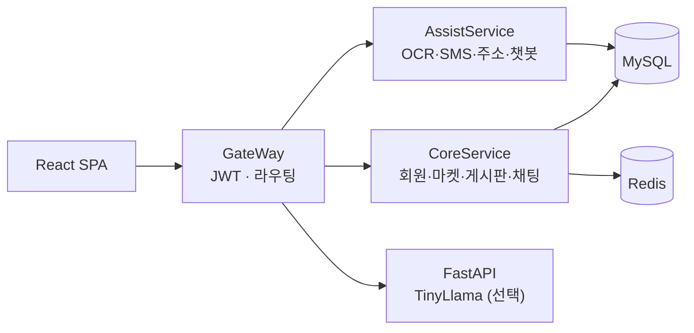

# Haru

취미 기반 모임, 위치 기반 거래, 실시간 채팅을 하나로 묶은 웹 서비스입니다.
Spring Boot 마이크로서비스(게이트웨이 · Core · Assist)와 React SPA로 구성되어 있습니다.

> 팀 프로젝트로 개발한 서비스를 기준선(2026-06)으로 잡고, 이후 백엔드 안정화(보안·트랜잭션·DB 마이그레이션·테스트)를 이어서 진행한 저장소입니다.
> 기준선 이전의 개별 커밋 이력은 이 저장소에 없습니다. 이후 작업은 [개선 이력](docs/history/changelog.md)에 정리되어 있습니다.

## 주요 기능

- **회원**
  - 이메일 로그인(JWT)
  - 소셜 로그인(Google · Naver · Kakao)
  - SMS 인증번호
  - 로그인 실패 누적 잠금, 회원 탈퇴
- **취미**: 카테고리-취미 계층, 가입 시 취미 조합 검증
- **위치 기반 마켓**
  - 상품 등록(다중 이미지), 반경 검색, 카테고리·가격 정렬
  - 참여 신청 → 승인 → 거래 → 결제 기록
- **실시간 채팅**: STOMP WebSocket 메시지·이미지, 읽음 처리, 승인, 실시간 위치 공유
- **모임 게시판**: 멤버 초대·수락, 방장 위임, 게시글·댓글·대댓글·반응
- **알림**: Redis Pub/Sub + STOMP 푸시
- **부가 기능**: 카드 OCR, 주소 검색(카카오), AI 고객지원 챗봇(TinyLlama), PWA

## 아키텍처



프론트엔드는 게이트웨이만 호출합니다. 자세한 구조는 [아키텍처 문서](docs/architecture.md)를 참고하세요.

## 기술 스택

| 영역 | 기술 |
|---|---|
| Backend | Java 17, Spring Boot 3.3, Spring Cloud Gateway, Spring Security, MyBatis, WebSocket(STOMP), OAuth2 Client, jjwt |
| Data | MySQL 8, Redis 7 |
| Frontend | React 19, TypeScript, Vite 6, Redux Toolkit, TanStack Query, Tailwind CSS, Leaflet |
| AI | FastAPI, llama.cpp(gguf), TinyLlama-1.1B |
| Test / CI | JUnit 5, Mockito, MockMvc, 실제 MySQL·Redis 통합 테스트, Vitest, GitHub Actions |
| Infra | Docker, Docker Compose |

## 빠른 시작

```bash
cp .env.compose.example .env      # MYSQL_ROOT_PASSWORD, REDIS_PASSWORD, JWT_SECRET 값 채우기
docker compose --profile ui up -d --build
docker compose exec -T mysql sh -c 'MYSQL_PWD="$MYSQL_ROOT_PASSWORD" mysql -uroot' < sql/seed-local.sql
```

- 프론트엔드: <http://localhost:3000>
- 게이트웨이: <http://localhost:8080>
- 테스트 계정: `test1@haru.com` / `Haru!local1`

로컬 직접 실행, 환경변수, 테스트 방법은 [개발 가이드](docs/development.md)를 참고하세요.

## 저장소 구조

```
.
├── GateWay/               # Spring Cloud Gateway — JWT 검증, 라우팅
├── CoreService/           # 핵심 도메인 서비스
├── AssistService/         # 외부 API 연동 서비스
├── FastAPI/               # AI 챗봇 (선택)
├── vite-react-teamsketch/ # React 프론트엔드
├── sql/                   # 스키마 기준선, 마이그레이션, 마이그레이션 러너, 시드
├── MySQL/                 # (레거시) 초기 테이블 설계 노트
├── docs/                  # 문서
├── compose.yaml           # Docker Compose 개발 스택
└── run-local.sh           # 로컬 직접 실행 스크립트 (macOS)
```

## 문서

| 문서 | 내용 |
|---|---|
| [아키텍처](docs/architecture.md) | 서비스 구성, 인증·인가, 실시간 메시징, 거래 정합성, 알려진 제약 |
| [API 레퍼런스](docs/api.md) | REST 엔드포인트, STOMP 목적지, 응답 형식 |
| [데이터베이스](docs/database.md) | 스키마, 마이그레이션 러너, 시드 데이터 |
| [개발 가이드](docs/development.md) | 실행, 환경변수, 테스트, CI |
| [개선 이력](docs/history/changelog.md) | 기준선 이후 작업 기록 |
| [백엔드 하드닝 기록](docs/history/backend-hardening.md) | 보안·정합성 수정의 변경 전후 비교 |
