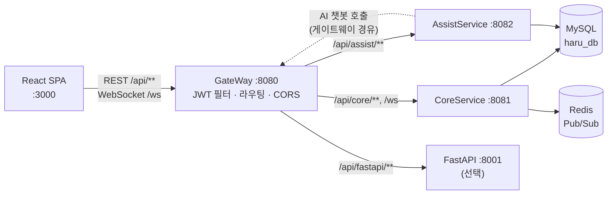

# 아키텍처

Haru는 프론트엔드가 **게이트웨이 한 곳만** 호출하고, 게이트웨이가 JWT 검증과 라우팅을 맡는 구조입니다.
도메인 로직 대부분은 CoreService에 있고, 외부 API 연동(OCR·SMS·주소 검색·AI 챗봇)은 AssistService로 분리되어 있습니다.

## 서비스 구성



| 서비스 | 포트 | 스택 | 역할 |
|---|---|---|---|
| GateWay | 8080 | Spring Boot 3.2 · Spring Cloud Gateway (WebFlux) | 단일 진입점, JWT 검증, CORS, 라우팅 |
| CoreService | 8081 | Spring Boot 3.3 · Spring Security · MyBatis · Redis · STOMP · OAuth2 Client | 회원·프로필·취미, 마켓(상품·거래·결제), 게시판, 채팅, 위치, 알림 |
| AssistService | 8082 | Spring Boot 3.3 · MyBatis | 네이버 클라우드 OCR, SMS OTP, 카카오 주소 검색, AI 챗봇 프록시(번역 포함) |
| FastAPI | 8001 | FastAPI · llama.cpp(gguf) · TinyLlama-1.1B | 고객지원 AI 챗봇. 선택 실행 |
| Frontend | 3000 | React 19 · Vite 6 · TypeScript · Redux Toolkit · TanStack Query | 웹 UI (PWA) |
| MySQL | 3306 | MySQL 8 | 영속 데이터 (`haru_db`) |
| Redis | 6379 | Redis 7 | 채팅·알림 Pub/Sub (CoreService 전용) |

- 모든 Java 서비스는 Java 17 toolchain으로 빌드합니다.
- CoreService와 AssistService는 **같은 데이터베이스(`haru_db`)를 공유**합니다.

## 요청 흐름

```
React ──REST──▶ GateWay(8080) ──▶ CoreService(8081) / AssistService(8082) / FastAPI(8001)
React ──WS────▶ GateWay(8080)/ws ──▶ CoreService(8081)/ws (STOMP)
```

- 게이트웨이 라우트는 `GateWay/.../config/RouteConfig.java`에 정의되어 있습니다.
- `GATEWAY_PROFILE=prod`이면 컨테이너 이름(`core-container` 등)으로, 그 외에는 `localhost`로 라우팅합니다.

## 인증과 인가

### JWT

- CoreService가 로그인 시 HS256 JWT를 발급합니다. `sub`에는 이메일, `userId`와 `roles` 클레임이 들어갑니다.
- GateWay, CoreService, AssistService는 **같은 `JWT_SECRET`과 같은 키 파생 규칙**으로 토큰을 검증합니다.
  - 파생 규칙: 시크릿 문자열을 Base64로 인코딩한 결과의 바이트를 HMAC 키로 사용합니다.
  - 세 서비스의 규칙이 어긋나지 않도록 교차 계약 테스트로 고정되어 있습니다(`JwtCrossServiceContractTest`, Assist `TokenUtilsTest`).
- 로그아웃 시 토큰을 블랙리스트에 등록합니다. 블랙리스트는 CoreService **메모리**에 저장됩니다.

### 2단계 인가

1. **GateWay** (`JwtAuthenticationFilter`)
   - `PUBLIC_PATHS`에 없는 `/api/core/**`, `/api/assist/**` 요청은 유효한 토큰이 없으면 401로 차단합니다.
   - 공개 경로: 회원가입·로그인·로그아웃, OAuth2, 취미/카테고리 조회, `/ws`, `/topic/**`
2. **CoreService** (`SecurityConfig`, `JwtAuthenticationFilter`)
   - 토큰을 다시 검증해 `SecurityContext`를 구성합니다.
   - 경로별로 `permitAll` / `authenticated` / `hasRole("ADMIN")`을 적용합니다.
   - 리소스 소유자 확인(작성자·참여자·구매자 등)은 서비스 계층에서 합니다.

> 공개 경로 목록이 GateWay와 CoreService 두 곳에 있으므로, 공개 경로를 바꿀 때는 **두 곳을 함께** 수정해야 합니다.
> 두 목록이 어긋나서 생긴 장애 사례는 [트러블슈팅 기록](history/troubleshooting-gateway-whitelist.md)을 참고하세요.

### 소셜 로그인

Google·Naver·Kakao OAuth2를 지원합니다(`security/oauth2/`). 로그인에 성공하면 JWT를 발급하고 `OAUTH2_REDIRECT_URI`로 리다이렉트합니다.

### WebSocket(STOMP) 인증

GateWay는 `/ws`를 JWT 필터에서 제외합니다. 따라서 CoreService의 `StompAuthChannelInterceptor`가 WebSocket의 유일한 방어선입니다.

- **CONNECT**: `Authorization` 헤더의 JWT를 검증하고, 활성(`Active`) 계정이 아니면 연결을 거부합니다.
- **SUBSCRIBE**: 채팅방 토픽은 그 채팅방 참여자만, 사용자 알림 토픽(`/topic/user/{email}`)은 본인만 구독할 수 있습니다.
- **SEND**: 메시지 본문의 `chatroomId`가 목적지와 일치하고, 보낸 사람이 그 채팅방 참여자일 때만 허용합니다.
- **서버 → 클라이언트**: 서버가 내보내는 메시지도 같은 구독 규칙으로 다시 검사합니다.
- **Origin**: 허용된 Origin(`app.cors.allowed-origins`)에서만 연결할 수 있습니다.

## 실시간 메시징

| 구분 | 경로 |
|---|---|
| 엔드포인트 | `/ws` (게이트웨이 경유 `ws://localhost:8080/ws`) |
| 클라이언트 → 서버 | `/app/chat/send`, `/app/location/{chatroomId}` |
| 채팅방 메시지 구독 | `/topic/room.{chatroomId}`, `/topic/chat.{chatroomId}` (Redis 경유) |
| 위치 공유 구독 | `/topic/location.{chatroomId}` |
| 사용자 알림 구독 | `/topic/user/{email}` |

- 채팅 메시지와 알림은 Redis Pub/Sub 채널(`chat`, `notification`)로 발행한 뒤, 리스너가 STOMP 토픽으로 다시 전달합니다.
- 채팅 이력 조회와 읽음 처리는 REST API로 제공합니다.

## CoreService 계층 구조

```
controller ─▶ service ─▶ mapper(interface) ─▶ mapper XML ─▶ MySQL
    │            │
security      listener (Redis Pub/Sub, WebSocket 이벤트)
config        exception (GlobalExceptionHandler)
```

- 도메인별로 하위 패키지를 나눕니다: `board/`, `Market/`, `chat/`.
- 예외 처리는 `GlobalExceptionHandler`가 담당합니다.

| 예외 | 응답 |
|---|---|
| `@Valid` 검증 실패, `IllegalArgumentException` | 400 |
| `UnauthorizedException` | 401 |
| `ForbiddenException` | 403 |
| `NotFoundException` | 404 |
| 그 외 | 500 (일반 메시지만 반환) |

응답 봉투는 도메인마다 다릅니다. 자세한 형식은 [API 문서](api.md#응답-형식)를 참고하세요.

## 거래·결제 정합성

마켓의 요청 승인 → 거래 생성 → 결제 흐름은 다음 원칙으로 구현되어 있습니다.

- **행 잠금**
  - 승인·거래 생성·결제는 `SELECT ... FOR UPDATE`로 상품·요청·거래 행을 잠근 뒤 상태를 검사합니다.
  - 채팅방에서 승인할 때의 잠금 순서는 `chatroom → product → request`로 고정합니다.
- **멱등성**: 같은 요청을 다시 승인하거나 거래를 다시 생성하면, 새로 만들지 않고 기존 결과를 반환합니다.
- **서버 측 값 결정**
  - 구매자·판매자·가격은 클라이언트 입력이 아니라 상품과 승인 요청에서 가져옵니다.
  - 결제 금액은 서버가 남은 금액으로 계산합니다.
- **커밋 후 알림**: 승인 알림은 `TransactionSynchronization.afterCommit`에서 보냅니다. 롤백된 승인은 알림으로 새지 않습니다.
- **타인 리소스 은닉**: 참여하지 않은 거래는 403이 아니라 404로 응답해, 거래가 존재하는지 드러내지 않습니다.

위 동작은 실제 MySQL을 쓰는 통합 테스트(`D01ApprovalIntegrationTest`, `D04TransactionPaymentIntegrationTest`)로 검증합니다.

## 알려진 제약

- **DB 공유**: CoreService와 AssistService가 같은 스키마를 씁니다. 서비스별로 데이터가 독립되어 있지 않습니다.
- **공개 경로 이중 관리**: GateWay `PUBLIC_PATHS`와 CoreService `SecurityConfig`를 함께 수정해야 합니다.
- **FastAPI 라우트 무인증**: `/api/fastapi/**`는 AssistService의 서버 간 호출을 위해 JWT 필터를 걸지 않았습니다. 운영에 배포하려면 네트워크 격리나 서비스 토큰이 필요합니다.
- **단일 인스턴스 가정**: 토큰 블랙리스트와 SMS OTP는 각 서비스의 메모리에 저장됩니다. 인스턴스를 늘리면 공유 저장소(Redis 등)로 옮겨야 합니다.
- **업로드 경로**
  - 업로드 파일은 실행 디렉터리(`user.dir`) 기준 경로에 저장됩니다.
  - Docker 이미지는 작업 디렉터리를 `/data` 볼륨으로 두어 이 문제를 피합니다.
- **응답 봉투 혼재**: 마켓 도메인은 `BaseResponse`, 나머지는 `ApiResponse`를 씁니다.
